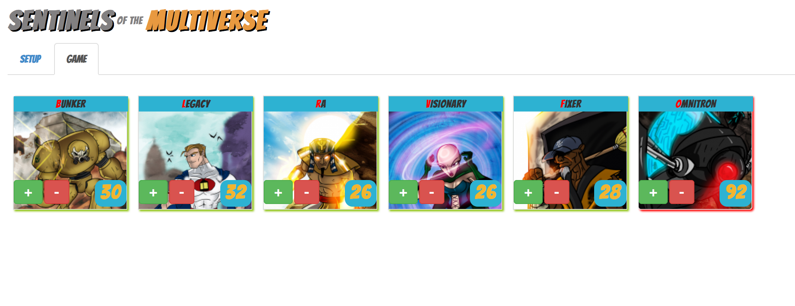
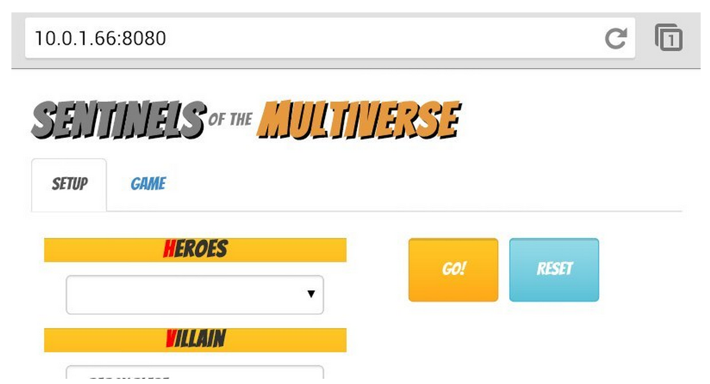
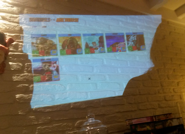
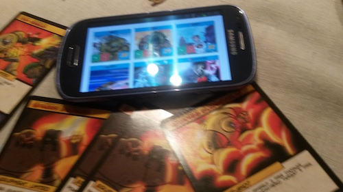

# Counter app for Sentinels of the Multiverse

This is an application I wrote that you can use while playing the boardgame [Sentinels of the Multiverse](https://sentinelsofthemultiverse.com/). While the game has round tokens to keep track of each hero's HP, this gets confusing rather quickly, when other heroes in the game can change your HP constantly. With this app every player can increment/decrement every hero's HP.

This app requires you to have a server instance running, so my typical setup is a raspberry pi that creates a new network to which every player can connect. You can even attach a projector to the pi if you're feeling fancy.

### Behind the scenes
This app uses CloudTypes to make sure that every update to the counters (HP) are eventually consistent on every running instance of the application. This means that players can use the app while offline or make changes simultaneously.

CloudTypes is a JavaScript library implementation of the CloudTypes model written by Tim Coppieters. The model is demonstrated in the paper CloudTypes for Eventual Consistency by Sebastian Burckhardt, Manuel Fahndrich, Daan Leijen, and Benjamin P. Wood. You can check it out on [github][1] and [npm][2].

[1]: https://github.com/ticup/CloudTypes
[2]: https://www.npmjs.com/package/cloudtypes

